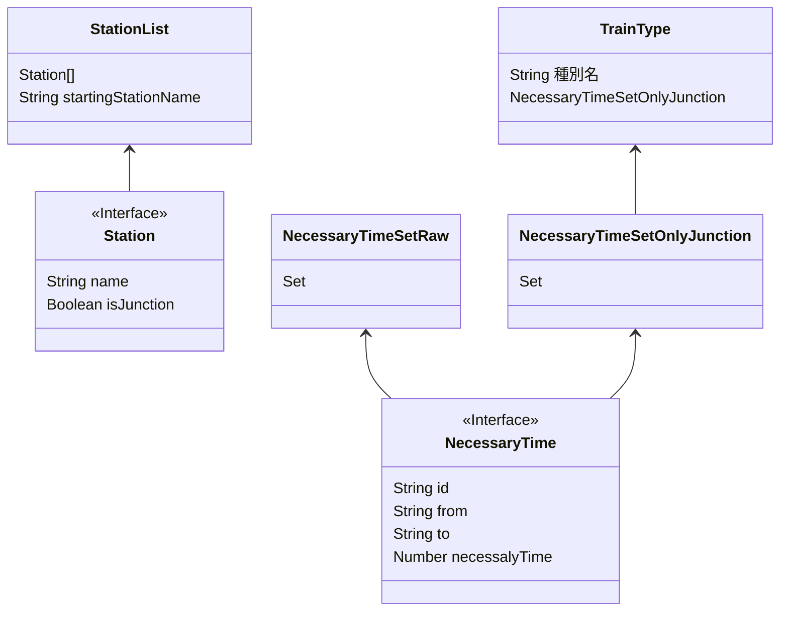

```mermaid
classDiagram
  class Station {
    <<Interface>>
    String name
    Boolean isJunction
  }

  class StationList {
    Station[]
    String startingStationName
  }

  class NecessaryTime {
    <<Interface>>
    String id
    String from
    String to
    Number necessalyTime
  }

  class NecessaryTimeSetRaw {
    Set<NecessaryTime>
  }

  class NecessaryTimeSetOnlyJunction {
    Set<NecessaryTime>
  }

  class TrainType {
    String 種別名
    NecessaryTimeSetOnlyJunction
  }

  StationList <-- Station
  NecessaryTimeSetRaw <-- NecessaryTime
  NecessaryTimeSetOnlyJunction <-- NecessaryTime
  TrainType <-- NecessaryTimeSetOnlyJunction
```
